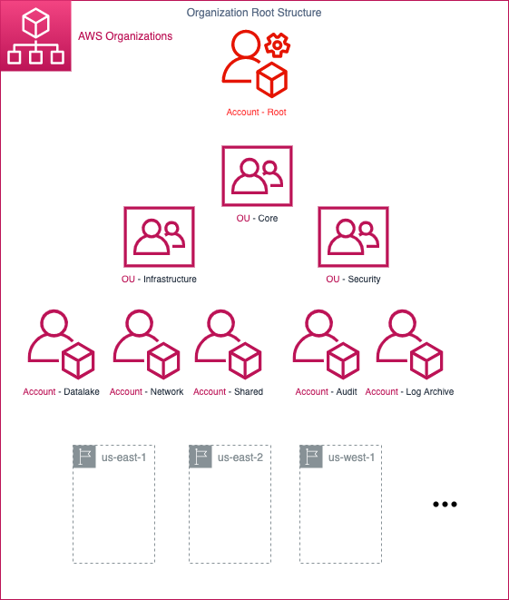
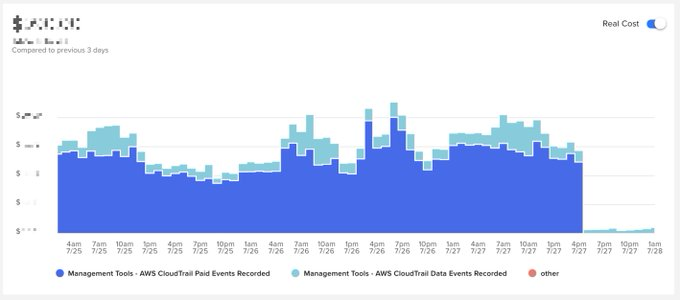
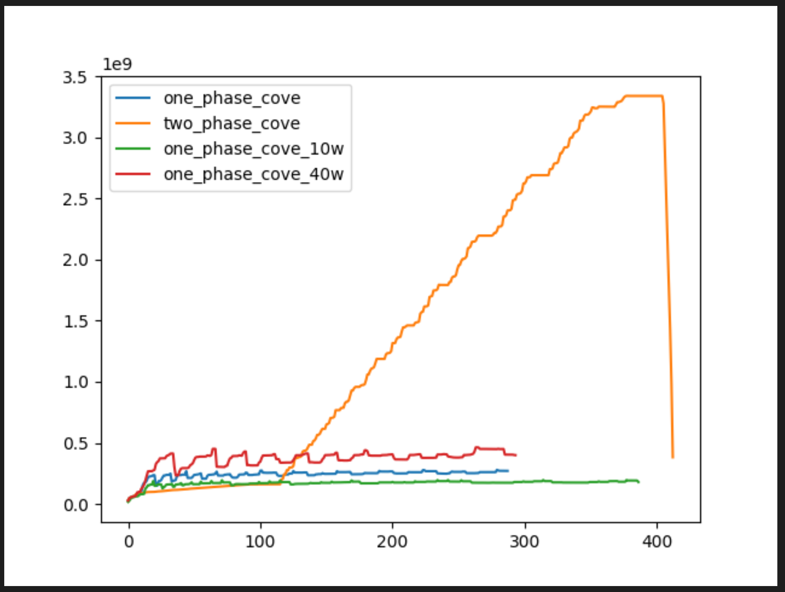

<!-- _class: invert -->

<!--

In Open Source we love animals. And in AWS we love to program in Python. So when AWS adopted the community framework boto as its official SDK, of course we got to adopt a new mascot, the Boto dolphin. It swims the rivers of the Amazon rainforest!

So what is Botocove? Well, a normal boto function runs in one account and region at a time.

Botocove runs that function across all the accounts and regions you want and groups together the results. That's all it does, and it's really powerful.

And why "cove"? Dave Connell started the project and he said:

> It turns out that the Amazon's Boto dolphins are solitary or small-group animals, unlike the large pods of dolphins in the oceans. This killed my "large group of boto" idea, so the next best idea was where might they all shelter together... a cove!

Fair enough! It's just unfortunate that it's just one letter different from "botocore", the core of the main boto library, which is popular enough to trigger Google's autocorrector.

Personally I think "botoplex" would be cooler, but I haven't asked Dave yet!

Image source: https://en.wikipedia.org/wiki/Amazon_river_dolphin#/media/File:Boto-cor-de-rosa_(Inia_geoffrensis).jpg

-->

<style scoped>{ justify-content: start;}</style>

### Botocove


---

<!--

In case you couldn't tell, I like programmatic access to AWS.

I like Botocove because I use it to solve problems in all these areas.

Before I move on, a shout out again to Dave Connell, who now works at AWS, and gave me the moral support I needed to get in front of you all today and share my enthusiasm for the tool.

-->

```console
$ aws sts get-caller-identity
```

```json
{
    "Name": "Iain Elder",
    "Roles": [
        "Independent Consultant",
        "Community Builder since 2023",
        "New Voices class of 2024"
    ],
    "Favorite Topics": [
        "Security posture management",
        "Cost optimization",
        "Automation"
    ]
}
```

---

<!--

The diagram is from Cody Penta who also works at AWS. In 2021 published an article about how to solve this using the Go programming language.

When you start with a single AWS account such as the "root" here programmatic access is straightforward. You can access everything through a single boto Session.

As a company grows, so does the number of accounts. You create an organization to hold them all. You split workloads get split across accounts. You group accounts by their access policies.

Checking all of this programmatically gets harder with each new account.

AWS already provides features that work across all the accounts in the organization to govern and manage even the largest ones. If they are available to you, you should generally use those first.

But what if you've been dropped into project where none of that stuff is running yet and need to get similar results fast?

Botocove is the tactical tool you need.

Image source: https://aws.amazon.com/blogs/architecture/field-notes-building-multi-region-and-multi-account-tools-with-aws-organizations/

-->

### Growing pains



---

### CloudTrail

<!--

As you may know CloudTrail gives you the first copy of the management event history for free and it charges you for more copies.

Whether good or bad, people don't like to talk a lot about their CloudTrail costs, but I did find a chart from Erik Peterson's Twitter Feed.

The dark blue part is how much of his AWS bill he spent on redundant copies of CloudTrail. On the 27th of July he thurned them all off.

He's hidden the numbers, but let's imagine for the sake of urgency that it's ...

Image source: https://twitter.com/silvexis/status/1420524604867682305

-->



---

<!--

So here's the first use case I ever solved using Botocove.

Let me set the scene at my client.

My first big job was to upgrade CloudTrail, to replace all the account trails with an organization trail.

As you may know an organization trail is a safer default than account trails because it unconditionally covers all accounts and it prevents any member account from tampering with it.

Somehow the management of the legacy account trails had fragmented across multiple stack sets, and some trails had no stack.

Anyway, we had just rolled out the organization trail, and I thought we had stopped all the account trails.

Until we saw the CloudTrail usage in Cost Explorer a couple of weeks later.

At that time my team managed around 1000 AWS accounts. The extra copies were costing us this much.

-->

### $2,000 per day

---

Hello, world!

```python
@cove()
def hello_world(session):
    return "Hello, world!"
```

---

Hello, world!

```python
>>> hello_world()
{
    'Results': [
        {'Id': '973820050801', 'Result': 'Hello, world!'},
        {'Id': '219424528675', 'Result': 'Hello, world!'},
        {'Id': '726356392388', 'Result': 'Hello, world!'},
        {'Id': '620591330564', 'Result': 'Hello, world!'},
        {'Id': '483535468253', 'Result': 'Hello, world!'}
    ],
    'Exceptions': [],
    'FailedAssumeRole': []
}
```

---

<!--

In all the result of my examples I have filtered the Botocove results to show just the account ID and the function result.

By default Botoove will show you a complete result like this.

The first time I saw this I thought it was a lot to deal with until I realised that I could ignore it all. You can too.

Now you know the basic structure and call-and-response pattern of Botocove, let's use it fix our CloudTrail!

-->

Complete result example

```python
>>> hello_world()["Results"][0]
{
    'Id': '219424528675',
    'RoleName': 'OrganizationAccountAccessRole',
    'RoleSessionName': 'OrganizationAccountAccessRole',
    'AssumeRoleSuccess': True,
    'Partition': 'aws',
    'Name': 'Sandbox-B-3',
    'Arn': 'arn:aws:organizations::480783779961:account/...',
    'Email': 'iain+awsroot+edonsion@isme.es',
    'Status': 'ACTIVE',
    'Result': 'Hello, world!'
}
```

---

<!--

Iterating over resources in each account is still your responsibility.

-->

Describe trails

```python
@cove()
def describe_account_trails(session):
    client = session.client("cloudtrail")
    return [
        {"Name": trail["Name"], "HomeRegion": trail["HomeRegion"]}
        for trail in client.describe_trails()["trailList"]
        if not trail["IsOrganizationTrail"]
    ]
```

---

<!--

You remember you have trails set up in more regions.

-->

Describe trails

```python
>>> describe_account_trails()["Results"]
[
    {
        'Id': '973820050801',
        'Result': [
            {'Name': 'oldtrail1', 'HomeRegion': 'eu-central-1'},
            {'Name': 'oldtrail2', 'HomeRegion': 'eu-central-1'}
        ]
    },
    {
        'Id': '620591330564',
        'Result': [
            {'Name': 'oldtrail1', 'HomeRegion': 'eu-central-1'},
            {'Name': 'oldtrail2', 'HomeRegion': 'eu-central-1'}
        ]
    },
    ...
]
```

---

Describe account trails in more regions

```python
@cove(regions=["eu-central-1", "eu-west-1"])
def describe_account_trails_in_more_regions(session):
    ...
```

---

<!--

"I can do this with an AWS Config configuration aggregator!"

But can you tell if the trail is logging? DescribeTrails doesn't show that.

-->

Describe account trails in more regions

```python
[
    {
        'Id': '483535468253',
        'Region': 'eu-central-1',
        'Result': [
            {'Name': 'oldtrail1', 'HomeRegion': 'eu-central-1'},
            {'Name': 'oldtrail2', 'HomeRegion': 'eu-central-1'}
        ]
    },
    {
        'Id': '973820050801',
        'Region': 'eu-west-1',
        'Result': [
            {'Name': 'oldtrail1', 'HomeRegion': 'eu-west-1'},
            {'Name': 'oldtrail2', 'HomeRegion': 'eu-west-1'}
        ]
    },
    ...
]
```

---

Get logging statuses

```python
@cove(regions=["eu-central-1", "eu-west-1"])
def get_logging_statuses(session):
    client = session.client("cloudtrail")
    trail_list = [
        trail
        for trail in client.describe_trails()["trailList"]
        if not trail["IsOrganizationTrail"]
    ]

    return [
        {
            "Name": trail["Name"],
            "IsLogging": (
                client.get_trail_status(Name=trail["Name"])["IsLogging"]
            ),
        }
        for trail in trail_list
    ]
```

---

<!--

"I can do that with Steampipe!"

But how do you stop the trails?

-->

Get logging statuses

```python
>>> get_logging_statuses()["Results"]
[
    {
        'Id': '483535468253',
        'Region': 'eu-central-1',
        'Result': [
            {'Name': 'oldtrail1', 'IsLogging': True},
            {'Name': 'oldtrail2', 'IsLogging': True}
        ]
    },
    {
        'Id': '726356392388',
        'Region': 'eu-west-1',
        'Result': [
            {'Name': 'oldtrail1', 'IsLogging': True},
            {'Name': 'oldtrail2', 'IsLogging': True}
        ]
    },
    ...
]
```

---

Stop logging

```python
@cove(regions=["eu-central-1", "eu-west-1"])
def stop_logging(session):
    client = session.client("cloudtrail")
    trail_list = [
        trail
        for trail in client.describe_trails()["trailList"]
        if not trail["IsOrganizationTrail"]
    ]

    for trail in trail_list:
        client.stop_logging(Name=trail["Name"])

    return "Stopped"
```

---

<!--

Check once more to know if it really worked.

-->

Stop logging

```python
>>> stop_logging()["Results"]
[
    {'Id': '483535468253', 'Region': 'eu-central-1', 'Result': 'Stopped'},
    {'Id': '219424528675', 'Region': 'eu-central-1', 'Result': 'Stopped'},
    {'Id': '483535468253', 'Region': 'eu-west-1', 'Result': 'Stopped'},
    {'Id': '726356392388', 'Region': 'eu-central-1', 'Result': 'Stopped'},
    {'Id': '726356392388', 'Region': 'eu-west-1', 'Result': 'Stopped'},
    ...
]
```

---

<!--

That's it!.

You've saved your client a lot of money and you've saved the rainforest.

Stop logging in the Amazon!

"I can just loop over the accounts myself!"

-->

Get logging statuses again

```python
>>> get_logging_statuses()["Results"]
[
    {
        'Id': '620591330564',
        'Result': [
            {'Name': 'oldtrail1', 'IsLogging': False},
            {'Name': 'oldtrail2', 'IsLogging': False}
        ]
    },
    {
        'Id': '973820050801',
        'Result': [
            {'Name': 'oldtrail1', 'IsLogging': False},
            {'Name': 'oldtrail2', 'IsLogging': False}
        ]
    },
    ...
]
```

---

<!--

Making it fast in big organizations presents many problems.

Here's the first problem I solved together with Dave: boto memory leaks.

Each line represents a different implementation of botocove and shows how it consumes memory over its runtime.

The orange line was the original implementation. When it reached the top it would crash my computer and I'd lose up to an hour's work.

The other lines show stable memory use over time and a faster overall runtime.

Dave and I have never met in person, but we worked together over a GitHub issue to solve the problem so that you don't have to.

Open source in action!

-->

### Looping over AWS accounts? Easy!



---

### Thanks!

Give us a star on GitHub!

github.com/connelldave/botocove

`iain@isme.es`
